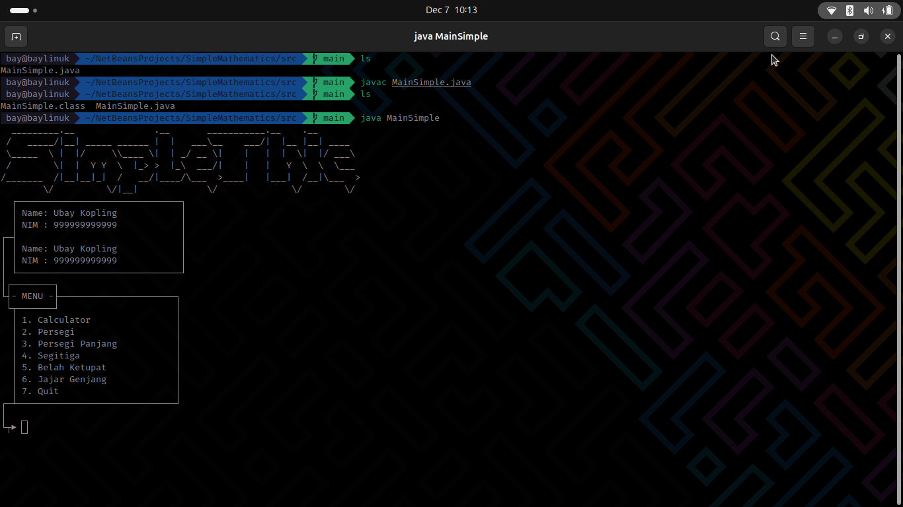
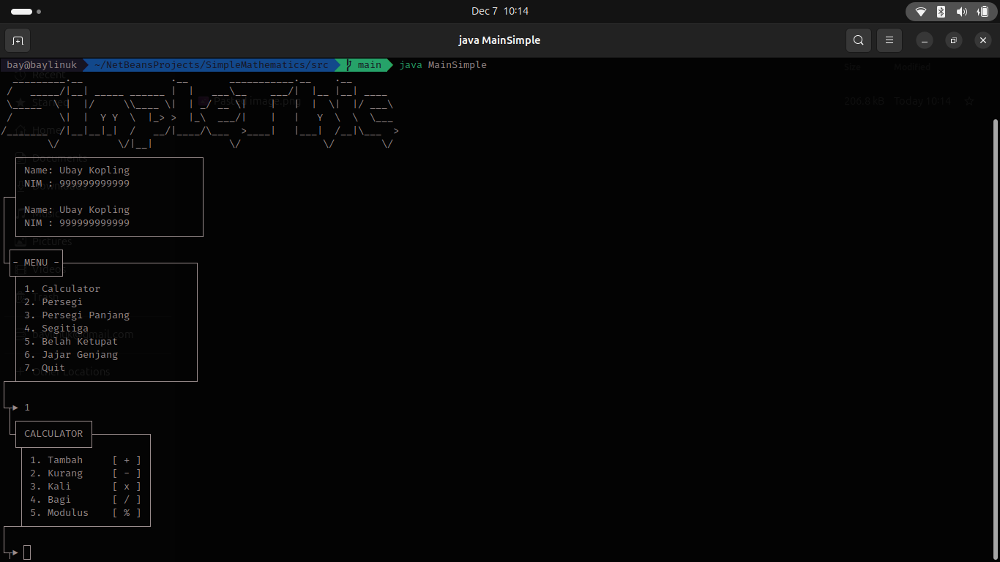

# SimpleMathematics (SimpleThic) 🧮


<p align="center">
  <a href="#english-description">🇺🇸 English</a> | <a href="#deskripsi-indonesia">🇮🇩 Indonesia</a>
</p>

---

<div id="english-description"></div>

## 🇺🇸 English Description

**SimpleMathematics** (also known as *SimpleThic*) is a Java-based Console Application that combines basic arithmetic calculations and geometric formulas.

What makes this project unique is its **User Interface**. Unlike standard text output, this program utilizes **ASCII Art borders and menus** to create a structured, "GUI-like" experience within the terminal.

### ✨ Key Features

1.  **Interactive CLI UI:**
    * Clean menu navigation with ASCII borders.
    * Visual representation of inputs and results.
2.  **🧮 Calculator Mode:**
    * Addition, Subtraction, Multiplication, Division.
    * Modulus (Remainder) operation.
3.  **📐 Geometry Mode:**
    * Calculate Area for:
        * Square (*Persegi*)
        * Rectangle (*Persegi Panjang*)
        * Triangle (*Segitiga*)
        * Rhombus (*Belah Ketupat*)
        * Parallelogram (*Jajar Genjang*)

### 🚀 How to Run

1.  Ensure you have Java installed.
2.  Clone this repository or download the source code.
3.  Compile the file:
    ```bash
    javac MainSimple.java
    ```
4.  Run the application:
    ```bash
    java MainSimple
    ```

---

<div id="deskripsi-indonesia"></div>

## 🇮🇩 Deskripsi Indonesia

**SimpleMathematics** (atau disebut *SimpleThic*) adalah aplikasi berbasis Java Console yang menggabungkan perhitungan aritmatika dasar dan rumus-rumus bangun datar.

Keunikan dari project ini terletak pada **Antarmuka Pengguna (UI)**. Berbeda dengan output teks biasa, program ini menggunakan **seni ASCII (ASCII Art)** untuk membuat kotak, border, dan menu yang terstruktur, memberikan pengalaman seperti menggunakan GUI di dalam terminal.

### ✨ Fitur Utama

1.  **Tampilan CLI Interaktif:**
    * Navigasi menu yang rapi dengan border ASCII.
    * Representasi visual yang jelas untuk input dan hasil.
2.  **🧮 Mode Kalkulator:**
    * Pertambahan, Pengurangan, Perkalian, Pembagian.
    * Modulus (Sisa Bagi).
3.  **📐 Mode Geometri (Bangun Datar):**
    * Menghitung Luas untuk:
        * Persegi
        * Persegi Panjang
        * Segitiga
        * Belah Ketupat
        * Jajar Genjang

### 🚀 Cara Menjalankan

1.  Pastikan Java sudah terinstall di komputer Anda.
2.  Clone repository ini atau download source codenya.
3.  Compile file menggunakan terminal/cmd:
    ```bash
    javac MainSimple.java
    ```
4.  Jalankan aplikasi:
    ```bash
    java MainSimple
    ```

---
## 📸 Screenshots

<p align="center">
  <b>Main Menu Interface</b><br>
  
</p>

<p align="center">
  <b>Calculator Menu</b><br>
  
</p>

---

<p align="center">
  Created with ❤️ by <b>BAY</b>
</p>
